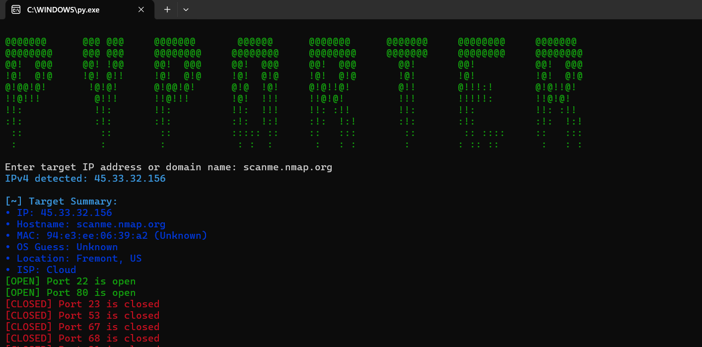
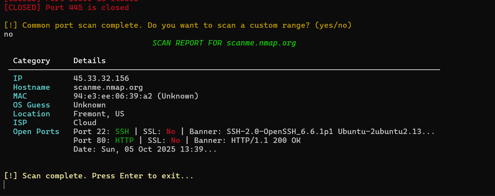

# PyPorter 🚀: Advanced Network Port Scanner 🔍

PyPorter is a Python-based advanced network port scanner designed for security enthusiasts, penetration testers, and network admins. It scans common and custom port ranges on IPv4/IPv6 targets, detects open ports, grabs service banners, checks for SSL, and displays results in a clean, colorized table format. 🎯

  

---

## Features ✨

- Supports scanning IPv4 and IPv6 addresses and domain names 🌐
- Scans a comprehensive list of common ports with service identification 🔌
- Supports customizable port range scanning upon user request 🛠️
- Concurrent scanning using multithreading for faster results ⚡
- Banner grabbing with improved accuracy, including HTTP/HTTPS probing 🏷️
- Reliable SSL detection with certificate handshake validation 🔒
- MAC address vendor lookup via local database 🏷️
- Clean terminal UI with colors and rich tabular output 🎨
- Graceful exit handling on Ctrl+C interrupt ✋

---

## Requirements 📦

- Python 3.7 or higher 🐍
- [colorama](https://pypi.org/project/colorama/) for colored terminal output 🎨
- [rich](https://pypi.org/project/rich/) for enhanced tables and console output 📋
- [scapy](https://pypi.org/project/scapy/) for ARP and MAC address scanning 📡
- [requests](https://pypi.org/project/requests/) for making HTTP requests (IP info, APIs)�

---

## Installation ⚙️

```bash
pip install -r requirements.txt
```
[OR]

```bash
pip install coloroma rich scapy requests
```
---

## 🛠 Usage

```bash
python pyporter.py
```
you will be prompted to:
- Enter an IP address or domain name 🌍
- PyPorter then scans all common ports automatically 🎯
- Optionally, scan a custom port range by entering a range like 1-1000 🧮
- View detailed results in a colorful, well-organized table 🖥️

To safely stop the scan at any time, press Ctrl+C. ✋

---

## Output 📤



---

## 📌 Notes

- Banner grabbing depends on the server’s responses; some services may not respond visibly. 🤫
- Always scan only on networks or hosts you have permission to scan to avoid legal issues. ⚖️

---

## 🤝 Contributing

Contributions, bug reports, and suggestions are warmly welcome. Feel free to fork and open pull requests! 🚀

---

## 📜 License

[Licensed under MIT License.](LICENSE)

---

### File Credits

- mac_vendor_list file was downloaded from [mac_vendor_list](https://gist.github.com/aallan/b4bb86db86079509e6159810ae9bd3e4)👏🏻
- author of file [Allan](https://gist.github.com/aallan)💪🏻

---

### Made with ❤️ by [Muthukumaran-Official](https://github.com/Muthukumaran-Official)👨‍💻
